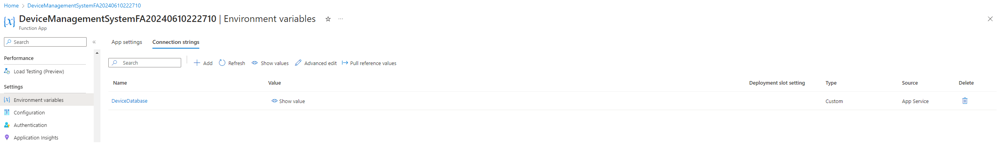
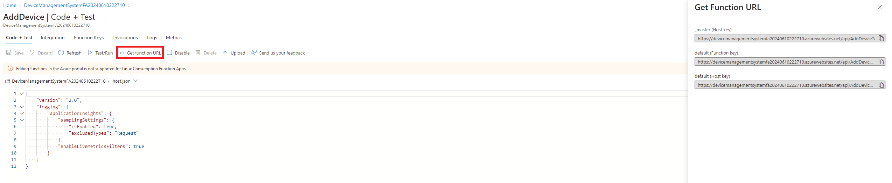

# Device Management System

The Device Management System aims to provide two APIs for adding and updating devices in a database. \
\
A device consist of the following properties: 

- <ins>**Serial number**</ins>: GUID
- <ins>**Model id**</ins>: string
- <ins>**Model name**</ins>: string
- <ins>**Manufacturer**</ins>: string
- Primary user: string
- Operating system: string
- <ins>**Device type**</ins>: enum
- <ins>Status</ins>: enum

<ins>Underlined</ins> properties are required when creating a device, and **bold** properties cannot be changed after creation.  \
\
The enums can be assigned either based on their integer value or through a string (accepting both lower and uppercase first letter). 

Device type enum mapping: 
- 0 -> Laptop
- 1 -> Desktop

Status enum mapping: 
- 0 -> Active
- 1 -> Inactive
- 2 -> Retired


## How to use

### Setting up connection strings

The solution makes use of a ConnectionStringHelper class to look for connection strings. It will prioritize looking for connection strings in the global variables using the names:  
`ConnectionStrings:DeviceDatabase` used in local.settings.json, and  
`CUSTOMCONNSTR_DeviceDatabase` used in Azure.  
If neither of these exist, it will look in the user secrets for the variable `ConnectionStrings:DeviceDatabase`.  
If you want to apply migrations, the user secret must contain a valid connection string. 

### Running the APIs locally

In the local.settings.json file for the DeviceManagementSystemFA project, you will need to add a database connection string for the device database.
As an example, you can create a local SQL Express database and put the connection string like so: 

```json
{
  "IsEncrypted": false,
  "Values": {
    "AzureWebJobsStorage": "UseDevelopmentStorage=true",
    "FUNCTIONS_WORKER_RUNTIME": "dotnet-isolated"
  },
  "ConnectionStrings": {
    "DeviceDatabase": ""Server=localhost\\SQLEXPRESS;Database=master;Trusted_Connection=True;TrustServerCertificate=True""
  }
}
```

Ensure that you add the migration to your database to have the correct scheme. 

After updating the local.settings.json file, you can run the project and query both the AddDevice and the UpdateDevice APIs from `localhost:port/api/AddDevice` and `localhost:port/api/UpdateDevice` respectively. The port number can be specified by adding `--port XYZ` as a command line argument.  


### Running the APIs in Azure

In order to run the function in Azure, you need an Azure account with an active subscription. If this is the case, you can deploy the project from Visual Studio. If a function app does not already exist, you ara able to create a new by following the visual studio publish information. \
Another thing required in Azure is an SQL database and a server. These can be manually setup from the portal, however, a guide is outside of the scope of this project. \
You will need to add the connection string of your database to the function app connection strings, as a custom connection string called `DeviceDatabase`. It should look like this: 



Ensure that migrations have been applied to this database. This can be done by adding the connection string to the project secrets using the name `ConnectionStrings:DeviceDatabase`.  \
When deployed, the endpoints can be reached from `https://functionAppName.azurewebsites.net/api/AddDevice?code=APIKey` and `https://functionAppName.azurewebsites.net/api/UpdateDevice?code=APIKey`. Both the real addresses and the keys can be retrieved from the portal if you click one of the APIs in the function app: 




### Input


In both APIs, the input is expected to be a json representation of the Device. As an example: 

```json
{
    "SerialNumber": "d9bfb5ff-89d4-4e8c-bb3d-51d1d79e3b8c",
    "ModelId": "A123",
    "ModelName": "Latitude 5490",
    "Manufacturer": "Dell",
    "PrimaryUser": null,
    "OperatingSystem": "Windows 11",
    "DeviceType": 0,
    "Status": 0
}
```

DeviceType and DeviceStatus can also be written as: 

```json
{
    "SerialNumber": "d9bfb5ff-89d4-4e8c-bb3d-51d1d79e3b8c",
    "ModelId": "A123",
    "ModelName": "Latitude 5490",
    "Manufacturer": "Dell",
    "PrimaryUser": null,
    "OperatingSystem": "Windows 11",
    "DeviceType": "Laptop",
    "Status": "Active"
}
```